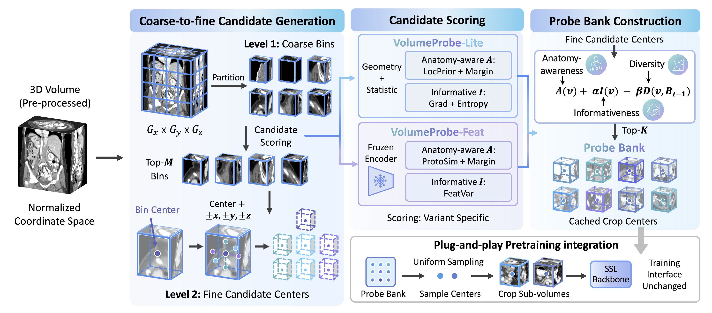

# VolumeProbe

**VolumeProbe** is a plug-and-play sub-volume sampling framework for **3D medical self-supervised learning**.

Our core idea is to revisit random cropping as a **where-to-look** problem. Instead of treating all spatial regions as equally useful, VolumeProbe builds an offline probe bank that reallocates the fixed crop budget toward more valuable sub-volumes.

VolumeProbe selects crop centers according to three simple principles:

- 🧠 **Anatomy-awareness**, which favors anatomically plausible regions
- 🔍 **Informativeness**, which prioritizes structurally rich sub-volumes
- 🧩 **Diversity**, which reduces redundant observations

By replacing random cropping with cached probe-bank sampling, VolumeProbe improves representation learning while keeping the SSL backbone and training objective unchanged.

## 📝 TODO

- [x] 📄 Paper released
- [√] 🧠 Pretraining code
- [√] 📦 Probe bank construction code
- [√] 🔧 Downstream evaluation code

## 🔎 Overview

Random sub-volume cropping is widely used in 3D medical SSL, but it can waste the fixed crop budget on low-yield, boundary-dominated, or redundant regions.

VolumeProbe reformulates sub-volume sampling as a structured observation policy. For each 3D volume, it constructs a cached bank of crop centers offline, then uniformly samples sub-volumes from this bank during pretraining.

  

## 💡 Key Ideas

VolumeProbe is built around three main principles.

<table>
  <thead>
    <tr>
      <th align="left" width="34%">Principle</th>
      <th align="left">Description</th>
    </tr>
  </thead>
  <tbody>
    <tr>
      <td>🧠 <b>Anatomy-awareness</b></td>
      <td>Encourages crop centers to lie in anatomically plausible and meaningful body regions.</td>
    </tr>
    <tr>
      <td>🔍 <b>Informativeness</b></td>
      <td>Prioritizes sub-volumes with richer local structures using image-statistical or feature-level cues.</td>
    </tr>
    <tr>
      <td>🧩 <b>Diversity</b></td>
      <td>Discourages the probe bank from collapsing to nearby or redundant locations.</td>
    </tr>
  </tbody>
</table>

Together, these principles help VolumeProbe select more useful observations under the same crop budget.

## ✨ Features

<table>
  <thead>
    <tr>
      <th align="left" width="34%">Feature</th>
      <th align="left">Description</th>
    </tr>
  </thead>
  <tbody>
    <tr>
      <td>🔌 <b>Plug-and-play</b></td>
      <td>Replaces random cropping without changing the SSL backbone, objective, or downstream pipeline.</td>
    </tr>
    <tr>
      <td>⚡ <b>Training-free</b></td>
      <td>Builds the probe bank offline with no learnable parameters or online reweighting.</td>
    </tr>
    <tr>
      <td>🌱 <b>Lightweight Lite variant</b></td>
      <td>Uses only geometric and image-statistical cues, without external encoders.</td>
    </tr>
    <tr>
      <td>🧬 <b>Diagnostic Feat variant</b></td>
      <td>Uses frozen visual features to study whether richer semantic cues further improve probing.</td>
    </tr>
    <tr>
      <td>📈 <b>Better transfer</b></td>
      <td>Improves downstream segmentation, classification, and registration across multiple SSL backbones.</td>
    </tr>
    <tr>
      <td>🔎 <b>Mechanistic analysis</b></td>
      <td>Connects better crop selection to more informative observations, reduced redundancy, faster learning, and more structured representations.</td>
    </tr>
  </tbody>
</table>

## 📊 Experimental Scope

VolumeProbe is evaluated with **3 medical SSL backbones**:

- VoCo
- S2DC
- MedGMAE

and across **3 downstream task families**:

- **Segmentation** on BTCV, AMOS, WORD, and Atlas-MRI
- **Classification** on CC-CCII
- **Registration** on IXI and OASIS

The experiments show that replacing random cropping with VolumeProbe yields consistent gains across different SSL objectives, backbones, crop sizes, and downstream tasks.

